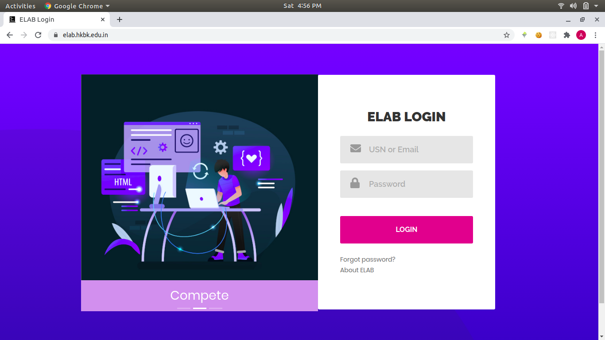
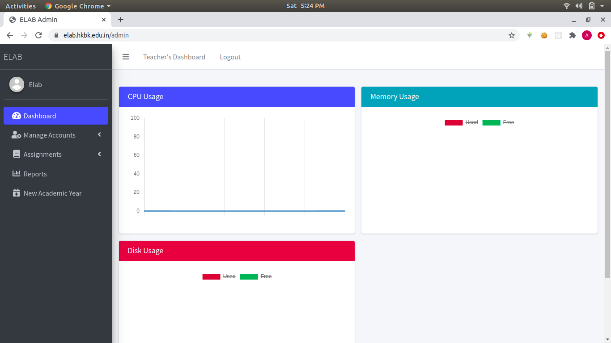
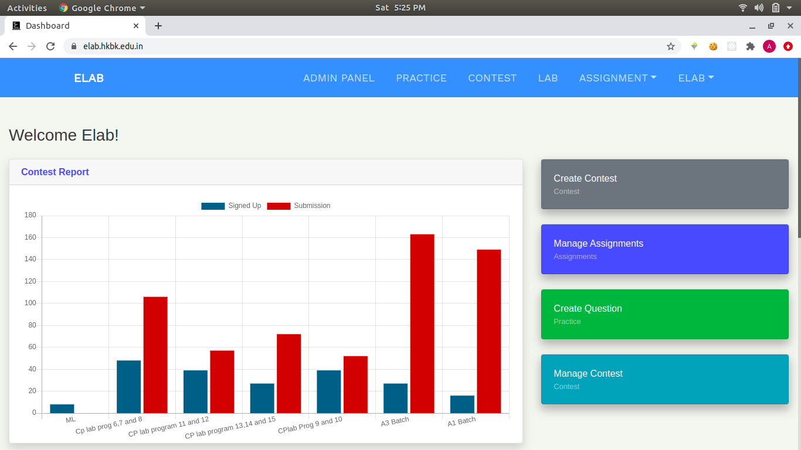

# ELAB
* ELAB is programming website with the help of which college labs can be conducted online, conduct contests among college students, solve various problems and practice coding challenges.
* This platform can be used to host competitive programming contests.
* It also has various other features for labs and contests such as report generation, access control, manual evaluation of submission etc.
* Along with that it has admin panel for managing the accounts, monitoring contests, labs and other admin operations.

Tools & Technologies – HTML5, Pug/Jade, CSS3, JavaScript, jQuery, Bootstrap 4, Node.js, MongoDB, Judge0 API.

# Login page

# Admin dashboard

#  Teacher dashboard

# Student dashboard

